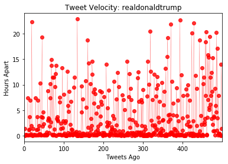
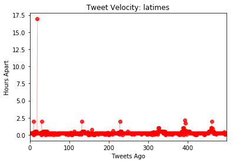

# Twitter Velocity

## Instructions

* You are a political data consultant, and have been asked to evaluate how frequently Donald Trump tweets. As a savvy data visualization specialist, you decide on the following course of action: first, you will collect the timestamps of the 500 most recent tweets sent out by Trump. After making a list of the timestamps, you will convert the timestamps into datetime objects. Then you will calculate the time difference from one tweet to the next, and plot those data points in a scatterplot chart.

* The tools you will use for this task are Tweepy and MatPlotLib. You will also need to use the `datetime` library to convert Twitter timestamps to Python datetime objects.

* Your plot should look something like this:

  

* This handy chart visually demonstrates Trump's tweet pattern: the majority of his tweets are sent within five hours of each other, but he goes up to 24 hours without tweeting!

* See, in contrast, the tweet pattern of a major news organization, the LA Times, whose tweets are sent out much more frequently:

  

* **Note**: Feel free to plot the tweets of another Twitter account. It does not have to be Donald Trump's!
